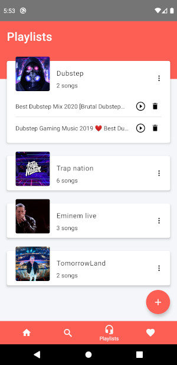
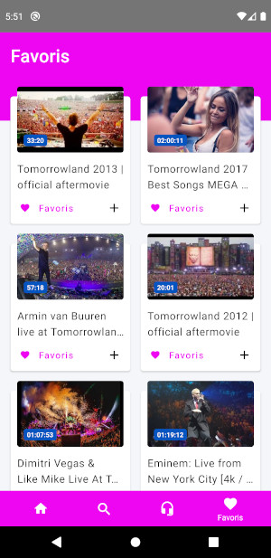
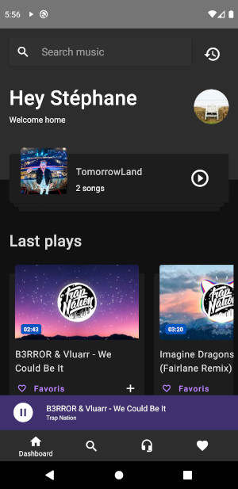
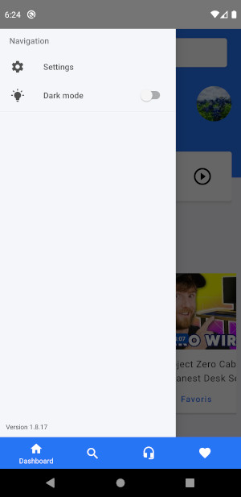
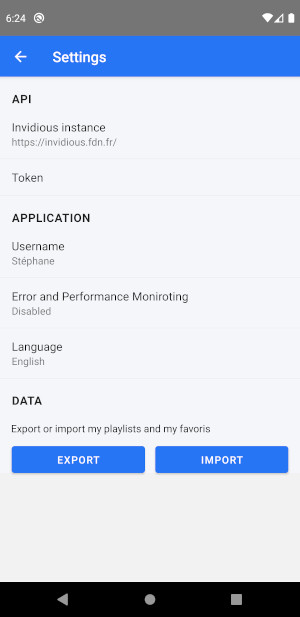

<h2 align="center">HoloPlay</h2>

    
    
    
    
    
    

HoloPlay (HoP) is a audio only Youtube alternative app using [Invidious API](https://github.com/omarroth/invidious). You can add your Invidious token and save music to favoris or create your playlists. This project is fully open source.

If you want add more feature, PM or PR are welcome :)

Interface based on beautiful free [Music Song](https://www.uplabs.com/posts/music-song).

## Android version compatibility

HoloPlay has been tested on real devices with Android version 8, 9 and 10. Android 5, 6 and 7 on Emulator only.

For now, HoloPlay is designed for mobile, not optimized for tablet device.

## Features

- **Search by video and playlist**
- **Live video**
- **Create your playlists**
- **Save on favoris**
- **Downloading video**
- **Background mode**
- **Offline**
- **Work on Android Auto**
- **Respect your privacy**
- **Open Source**
- **Cloud Syncing**
- **Dark Theme**
- **internationalization with EN (default) and FR**

## Getting Started

These instructions will get you a copy of the project up and running on your local machine for development and testing purposes. See deployment for notes on how to deploy the project on a live system.

### Prerequisites

[See React Native doc prerequisites](https://reactnative.dev/docs/getting-started#prerequisites)

### Installing

First, setup environment file :

`cp .env.dist .env`

Use correct Node version (>= 12) :

`nvm use`

Then, install dependencies :

`yarn install`

Start NodeJS development server :

`yarn start`

And run your Android emulator :

`yarn android:run`

## Built With

- [React Native](https://facebook.github.io/react-native/)
- [React Navigation](https://reactnavigation.org/)
- [React Native Paper](https://github.com/callstack/react-native-paper)
- [React Native Quick Actions](https://github.com/jordanbyron/react-native-quick-actions)
- [React Waterfall](https://github.com/didierfranc/react-waterfall)
- [TypeScript](https://www.typescriptlang.org/)

And more.

## Android permissions

- `INTERNET` : Connect to the network
- `FORGROUND_SERVICE` : used by [react-native-music-control](https://github.com/tanguyantoine/react-native-music-control)
- `READ_EXTERNAL_STORAGE`, `WRITE_EXTERNAL_STORAGE` and `DOWNLOAD_WITHOUT_NOTIFICATION` : for download and save downloaded file

All **STORAGE** permissions are requested only when you need use them.

## Error and performance monitoring

**HoloPlay** uses an self hosted [Sentry](https://sentry.io/welcome/) instance crash reporting library, **disabled** by default. This reporting can be enabled and disabled via settings screen.

## Contributing

Please read [CONTRIBUTING.md]() for details on our code of conduct, and the process for submitting pull requests to us.

## License

This project is licensed under the MIT.

## TODO

- [ ] Add video support
- [ ] UI for tablet
- [x] Submit on f-droid store
- [x] Adding music on playlist from all screen and player
- [x] Can create playlist from adding music on playlist dialog
- [x] Add popular/trending videos and search screen
- [x] Add i18n with EN and FR translation (EN default language)
- [x] Add update alert
- [x] Adding search type (video, playlists)
- [x] Show playlist on player view
- [x] Settings screen
