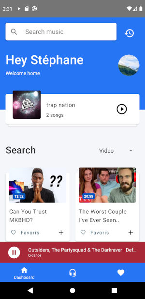
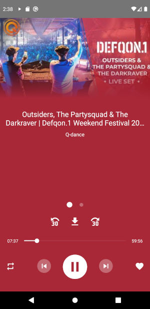
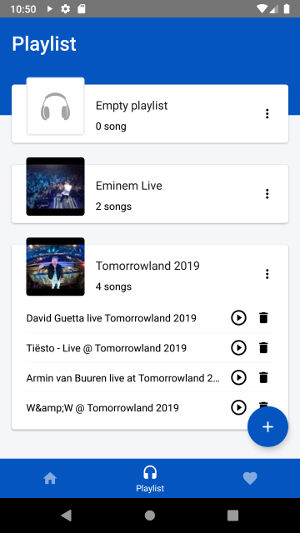
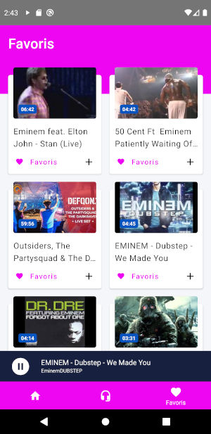
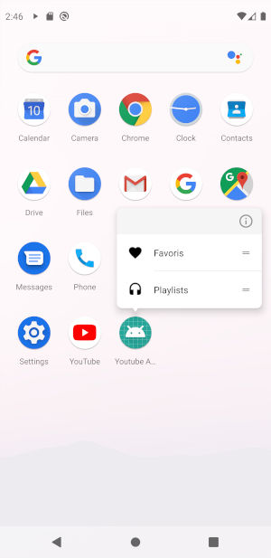

# HoloPlay :notes:   

HoloPlay (HoP) is an open source app, can stream Youtube audio with an open source [Invidious API](https://github.com/omarroth/invidious). You can add your Invidious token and save music to favoris or create your playlists.

HoP has not been tested on iOS because i'm on a Linux environment. PR needed are welcome :)

Interface based on beautiful free [Music Song](https://www.uplabs.com/posts/music-song).

## Features

- **Search by video and playlist**
- **Live video**
- **Create your playlists**
- **Save on favoris**
- **Downloading video**
- **Background mode**
- **Offline**
- **Work on Android Auto**
- **Respect your privacy**
- **Open Source**
- **Cloud Syncing**

## Getting Started

These instructions will get you a copy of the project up and running on your local machine for development and testing purposes. See deployment for notes on how to deploy the project on a live system.

### Prerequisites

[See React Native doc prerequisites](https://reactnative.dev/docs/getting-started#prerequisites)

### Installing

First, setup environment file :

`cp .env.dist .env`

Use correct Node version (>= 12) :

`nvm use`

Then, install dependencies :

`yarn install`

## Deployment

HoP bundle JS is updated with [Code-Push](https://github.com/Microsoft/code-push/tree/master/cli) on every tags.

See `.travis.yml` file for process.

## Built With

- [React Native](https://facebook.github.io/react-native/)
- [React Navigation](https://reactnavigation.org/)
- [React Native Paper](https://github.com/callstack/react-native-paper)
- [React Native Quick Actions](https://github.com/jordanbyron/react-native-quick-actions)
- [React Waterfall](https://github.com/didierfranc/react-waterfall)
- [TypeScript](https://www.typescriptlang.org/)

And more.

## Contributing

Please read [CONTRIBUTING.md]() for details on our code of conduct, and the process for submitting pull requests to us.

## License

This project is licensed under the MIT License.

## TODO

- [x] Adding search type (video, playlists)
- [x] Show playlist on player view
- [x] Settings screen
- [] Add user preferences screen (from invidious API)
- [] Compile on iOS
